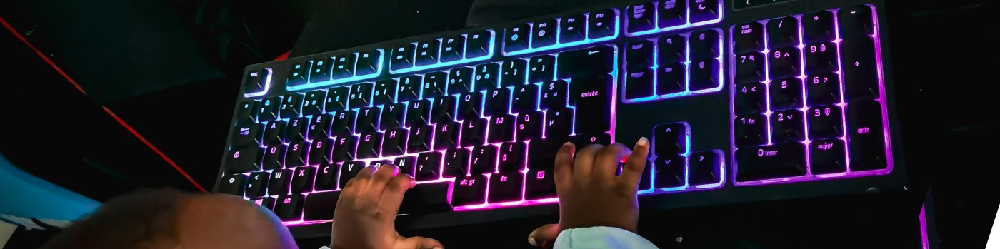

<!--Banner-->

<!--Night Owl image-->

  

<!--Header Name-->
#  ʜᴇʏ, ɪ'ᴍ DiacK!  
*👨‍💻 IT Maintainer & Web Development Explorer*

<!--Start Intro-->

Bienvenue sur mon profil GitHub ! Passionné d'informatique, je suis spécialisé dans la maintenance des systèmes, l'administration réseau et la cybersécurité. J’aime explorer, apprendre et repousser les limites du possible à travers le code.

- ✨ Chaque jour est une opportunité d’apprendre.
- 🧰 Expertise en maintenance matérielle et réseaux.
- 🧠 Curieux de nature, dénicheur de savoirs sur Internet.
- ❤ Geek affirmé et bidouilleur invétéré.
- 🔐 Fan d’ethical hacking et de rétro-ingénierie.
- 🌐 Passionné de développement web — je teste sans cesse de nouveaux outils, frameworks et langages.
- 🕹 Gamer dans l’âme — entre stratégie et personnalisation.

<!--End Intro-->

<!--Profile Count Badge-->

  

<!--Languages and Tools Section-->
<h2 align="center">🧰 Tᴇᴄʜ Sᴛᴀᴄᴋ 💻</h2> 
<picture>
  <source media="(prefers-color-scheme: dark)" srcset="./Skills_Animation_Dark.gif">
  <source media="(prefers-color-scheme: light)" srcset="./Skills_Animation_White.gif">
  
</picture>
 

<h3 align="left">📚 En apprentissage</h3>
<ul align="left">
  <li>Développement web — j’explore les langages, outils et frameworks modernes.</li>
  <li>Hacking éthique et reverse engineering</li>
</ul>

<!--Trophies Section-->   
<h2 align="center">🏆 Gɪᴛʜᴜʙ Tʀᴏᴘʜɪᴇs 🏆</h2>

  <a href="https://github.com/GUNNERSx">
    <picture>
      <source media="(prefers-color-scheme: dark)" srcset="https://github-profile-trophy.vercel.app/?username=GUNNERSx&no-bg=true&row=2&column=6&margin-w=20&margin-h=20&theme=monokai">
      <source media="(prefers-color-scheme: light)" srcset="https://github-profile-trophy.vercel.app/?username=GUNNERSx&no-bg=true&row=2&column=6&margin-w=20&margin-h=20">
      
    </picture>
  </a>

<!--Github stats Table--> 
<h2 align="center">📊 Sᴛᴀᴛɪsᴛɪǫᴜᴇs Gɪᴛʜᴜʙ 📊</h2>
<table width="100%">
  <tr>
    <td width="50%">
      <h3 align="center"><strong>Stats Générales</strong></h3>
      

        
      

    </td>
    <td width="50%">
      <h3 align="center"><strong>Streaks GitHub</strong></h3>
      

        
      

    </td>
  </tr>
  <tr>
    <td width="50%">
      <h3 align="center"><strong>Dernier Projet</strong></h3>
      

        
      

    </td>
    <td width="50%">
      <h3 align="center"><strong>Top Contributions</strong></h3>
      

        
      

    </td>
  </tr>
</table>

<!--Contribution Graph-->
<h2 align="center">📈 Graphique de Contributions 📈</h2>

    

---

<!--Quote of the day-->
<h2 align="center">🌟 Pensée du Jour 🌟</h2>

    

<!--Contact Section-->
<h2 align="center">🤝 Me contacter 🤝</h2>

  
  
  
  

<!--Footer-->

  

